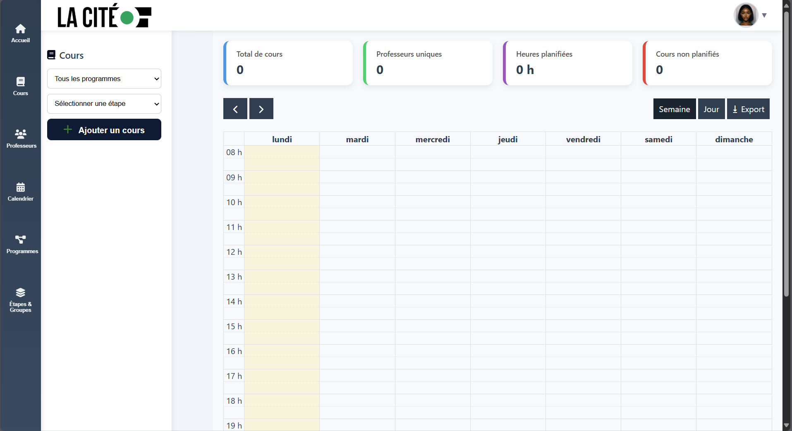
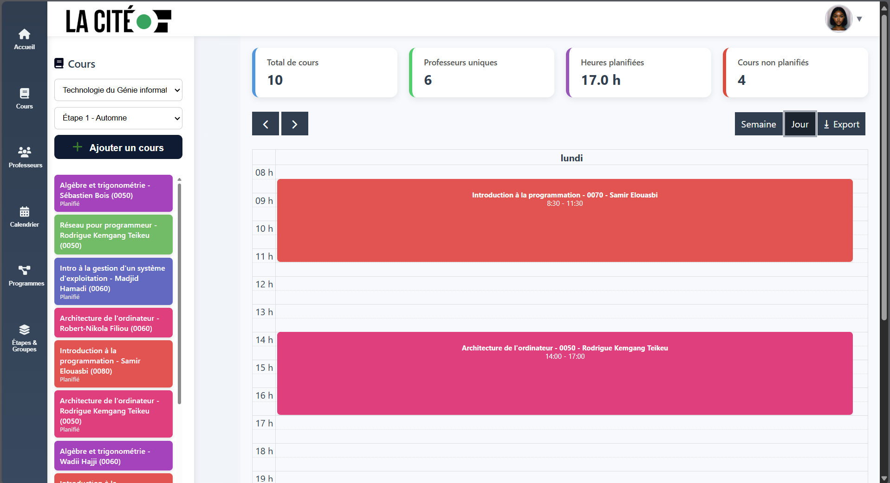
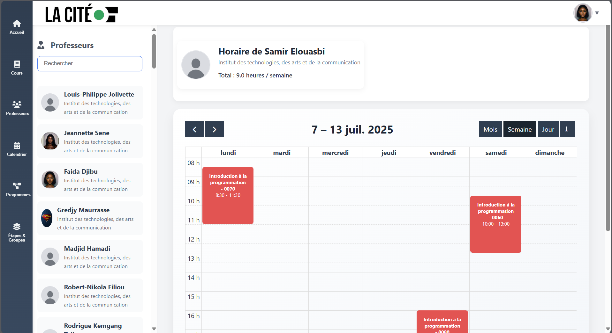
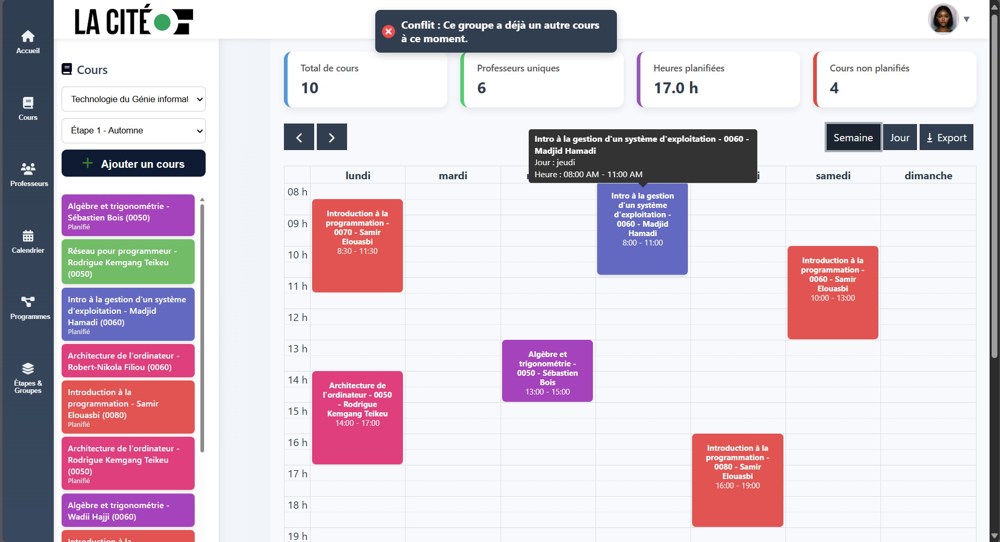
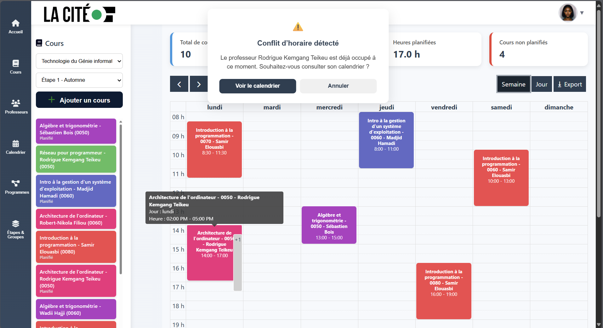
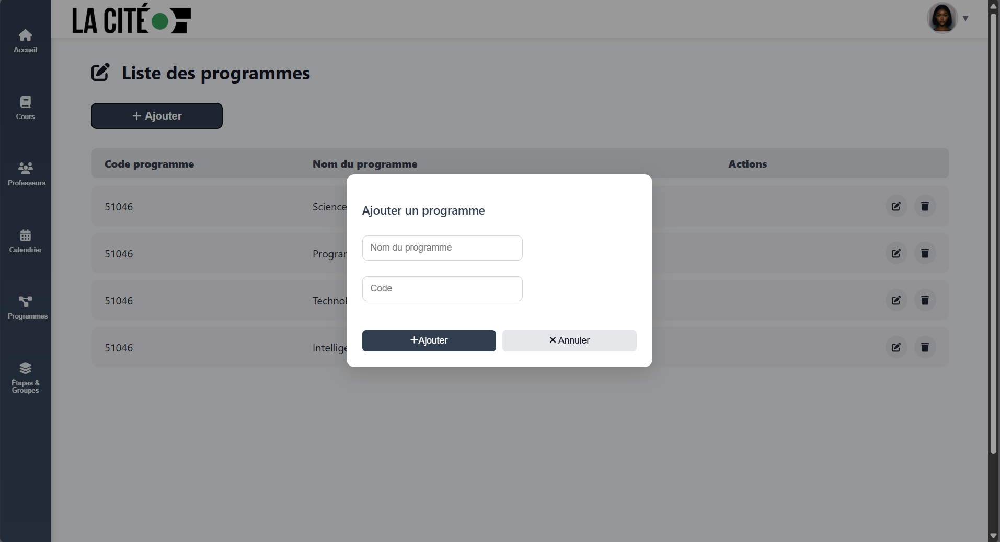
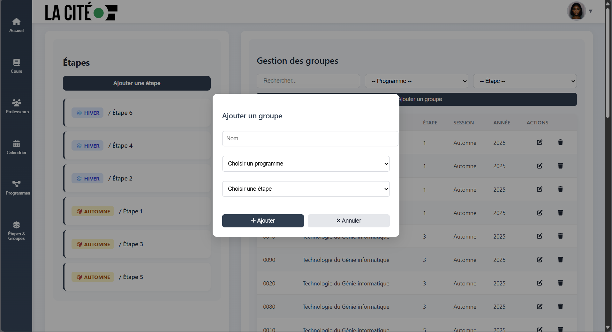

<h1 align="center">🗓️ HoraTech — Application de gestion des horaires scolaires</h1>

<p align="center">
  <i>HoraTech est une application web moderne et intuitive de <b>gestion des horaires scolaires</b> développée dans le cadre du programme de <b>Technologie du génie informatique</b> du Collège La Cité.</i><br>
  Elle permet d’automatiser la planification des cours, d’éviter les conflits d’horaire, et de centraliser la gestion des programmes, groupes, professeurs et cours dans une interface claire et professionnelle.
</p>

---

## 🧰 Stack technique

<p align="center">
  
  
  
  
  
  
  
  
  
  
</p>

---

## ✨ Fonctionnalités principales

- 🖱️ **Glisser-déposer (drag & drop)** pour planifier les cours sur le calendrier  
- 🧠 **Détection automatique des conflits** (enseignant, groupe, chevauchement)  
- 🏷️ **Filtres dynamiques** (enseignant, programme, groupe)  
- 👩‍🏫 **Affichage individuel par professeur** avec heures totales et calendrier dédié  
- 🔔 **Notifications interactives** (React Hot Toast / SweetAlert2)  
- 🗂️ **Gestion complète des entités** (professeurs, programmes, étapes, groupes, cours)  
- 🔎 **Recherche rapide** et vue condensée des semaines chargées  
- 🌐 **API REST Django** avec endpoints pour toutes les entités  
- 🧾 **Exportation du calendrier** (PDF ou ICS)

---


## 🖼️ Aperçu du projet

### 🧭 Tableau de bord & Calendrier
<p align="center">
   
   
  
  
  
  
</p>
<p align="center"><sub>Planification intuitive avec glisser-déposer et aperçu hebdomadaire.</sub></p>

### ⚠️ Détection de conflits
<p align="center">
  
  
  
</p>
<p align="center"><sub>Détection automatique des conflits d’enseignants et chevauchements.</sub></p>

### 🧩 Gestion des entités
<p align="center">
  
  
  
   
  
  
   
  
  
  
</p>
<p align="center"><sub>Gestion des professeurs, groupes, programmes et statistiques hebdomadaires.</sub></p>


---

## 🗂️ Structure du projet

```text
HoraTech/
├── backend/
│   ├── manage.py
│   ├── settings.py
│   ├── accounts/           # Authentification, rôles et utilisateurs
│   ├── scheduling/         # Gestion des horaires et détection de conflits
│   ├── courses/            # Gestion des cours, programmes, groupes
│   └── requirements.txt
│
├── frontend/
│   ├── src/
│   │   ├── components/
│   │   │   ├── CalendarView.js
│   │   │   ├── SidebarCourses.js
│   │   │   ├── DashboardCards.js
│   │   │   └── GroupList.js
│   │   ├── pages/
│   │   │   ├── Home.js
│   │   │   └── Professors.js
│   │   └── App.js
│   └── package.json
│
├── images/
│   ├── app1.png ... app10.png
└── README.md
