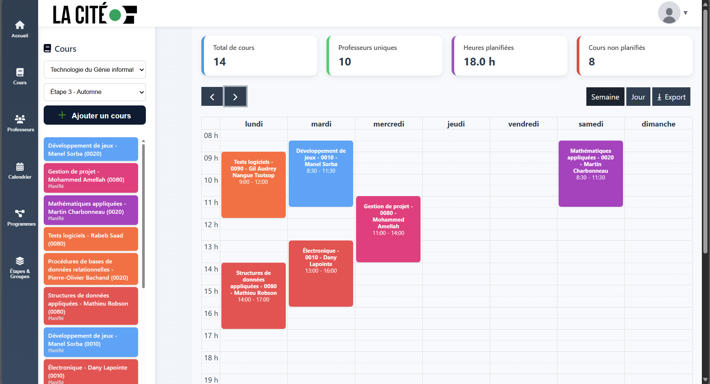
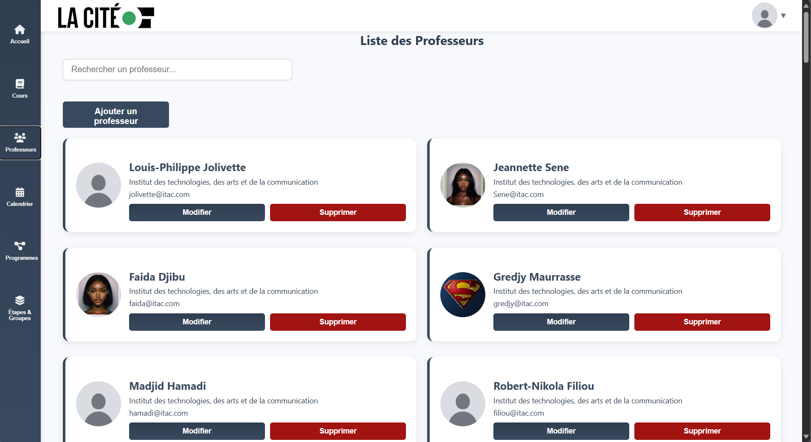
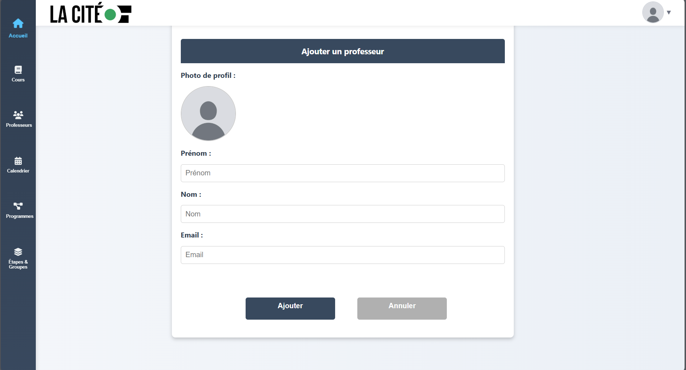
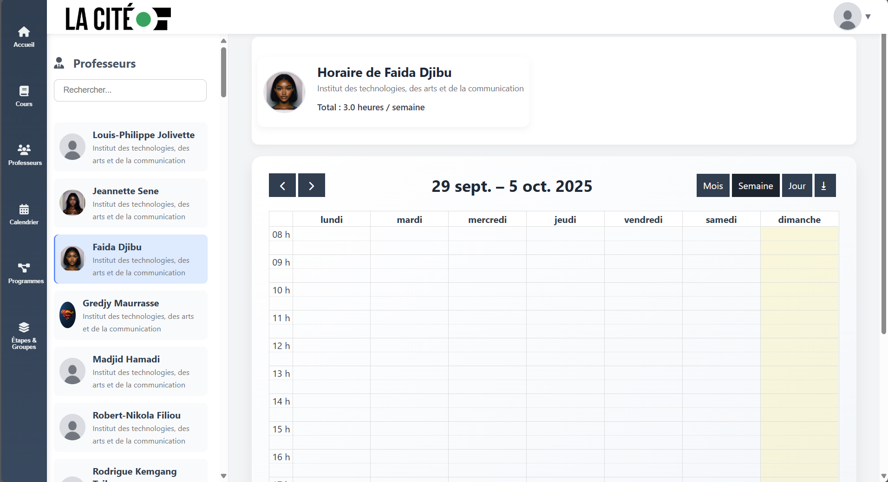
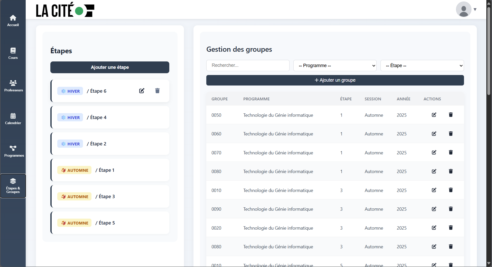
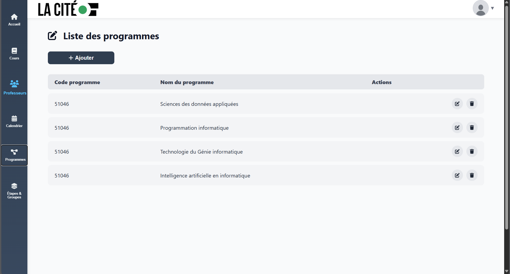
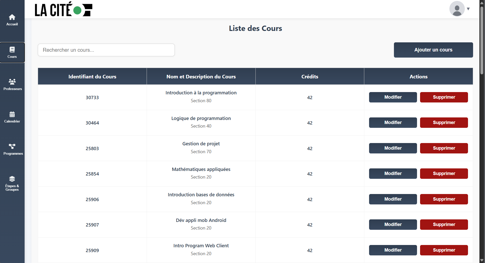

<h1 align="center">🗓️ HoraTech — Gestion d’Horaires</h1>
<p align="center">
  Application <b>full-stack</b> de gestion d’horaires avec <b>drag & drop</b>, <b>détection de conflits</b> et <b>rôles utilisateurs</b>.<br/>
  <i>React • Django REST • PostgreSQL</i>
</p>

<p align="center">
  <a href="#-démarrage-rapide">⚡ Démarrer</a> •
  <a href="#-fonctionnalités">✨ Fonctionnalités</a> •
  <a href="#-galerie">📸 Galerie</a> •
  <a href="#-stack-technique">🧰 Stack</a>
</p>

<p align="center">
  
  
  
  
  
</p>

---

## ✨ Fonctionnalités
- 🖱️ **Drag & drop** sur calendrier (jour/semaine/mois)  
- 🧠 **Détection de conflits** (enseignant, salle, chevauchement, capacité)  
- 🏷️ **Filtres dynamiques** (enseignant, programme, groupe, salle, statut)  
- 👥 **Rôles & permissions** (admin, coordonnateur, enseignant)  
- 🔔 **Avertissements** clairs en cas de conflit  
- 🔎 **Recherche** et vue condensée des semaines chargées  
- 🌐 **API REST** (Django REST Framework)

---

## 📸 Galerie
<p align="center">
  
  
  
  
  
</p>
<p align="center">
  
  
  
  
  
</p>

---

## 🧰 Stack technique
| Frontend | Backend | Base de données | Outils |
|:--:|:--:|:--:|:--|
| React | Django + DRF | PostgreSQL | Axios, FullCalendar, CORS, Git |

---

## 🗂️ Structure
```text
HoraTech/
├── itac_backend/
│   ├── backend/                  # settings.py, urls.py, wsgi.py, asgi.py
│   ├── accounts/                 # auth/roles (ex.)
│   ├── scheduling/               # modèles & endpoints horaires (ex.)
│   ├── manage.py
│   └── requirements.txt
├── itac_frontend/
│   ├── src/
│   ├── public/
│   └── package.json
├── images/                       # app1.png ... app10.png
└── README.md
